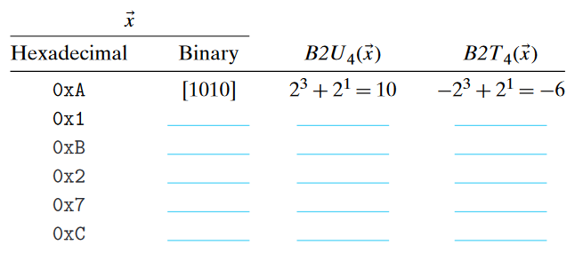
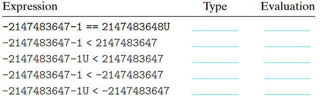
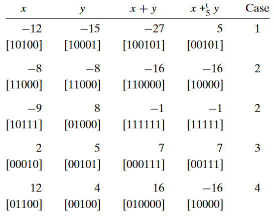

# 2.17

Assuming w = 4, we can assign a numeric value to each possible hexadecimal
digit, assuming either an unsigned or a two's-complement interpretation. Fill in
the following table according to these interpretations by writing out the nonzero
powers of 2 in the summations shown in Equations 2.1 and 2.3



| $Hexadecimal$ | $binary$ | $B2U_4(x)$       | $B2T_4(x)$        |
| ------------- | -------- | ---------------- | ----------------- |
| $0xA$         | $[1010]$ | $2^3 + 2^1 = 10$ | $-2^3 + 2^1 = -6$ |
| $0x1$         | $[0001]$ | $2^0=1$          | $2^0=1$           |
| $0xB$         | $[1011]$ | $2^3+2^1+2^0=11$ | $-2^3+2^1+2^0=-5$ |
| $0x2$         | $[0010]$ | $2^1=2$          | $2^1=2$           |
| $0x7$         | $[0111]$ | $2^2+2^1+2^0=7$  | $2^2+2^1+2^0=7$   |
| $0xC$         | $[1100]$ | $2^3 +2^2=12$    | $-2^3 +2^2=-4$    |

# 2.21

Assuming the expressions are evaluated when executing a 32-bit program on a ma-
chine that uses two’s-complement arithmetic, fill in the following table describing
the effect of casting and relational operations, in the style of Figure 2.19:



|Expression|Type|Evaluation|
| --- | --- | --- |
|$-2147483647-1 == 2147483648U$|Unsigned|1|
|$-2147483647-1 < 2147483647$|Signed|1|
|$-2147483647-1U < 2147483647$|Signed|0|
|$-2147483647-1 < -2147483647$|Signed|1|
|$-2147483647-1U < -2147483647$|Signed|0|

# 2.29
This problem is an exercise to make sure you understand two’s-complement
addition.



# 2.30
This function is a direct implementation of the rules given to determine whether
or not a two’s-complement addition overflows.
``` C
/* Determine whether arguments can be added without overflow */
int tadd_ok(int x, int y) {
    int sum = x + y;
    int neg_over = x < 0 && y < 0 && sum >= 0;
    int pos_over = x >= 0 && y >= 0 && sum < 0;
    return !neg_over && !pos_over;
}
```