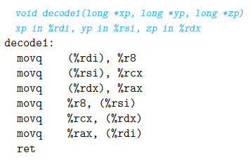
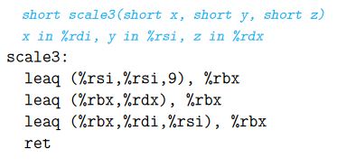
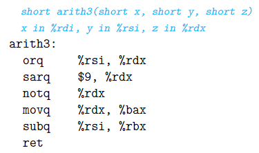

# Exercise 3.1

Assume the following values are stored at the indicated memory addresses and
registers:
|Address|Value|Register|Value|
|-|-|-|-|
|$0x100$|$0xFF$|$\%rax$|$0x100$|
|$0x104$|$0xAB$|$\%rcx$|$0x1$|
|$0x108$|$0x13$|$\%rdx$|$0x3$|
|$0x10C$|$0x11$|||

Fill in the following table showing the values for the indicated operands:

| Operand | Value |
| ------- | ----- |
|$\%rax$|$0x100$|
|$0x104$|$0xAB$|
|$\$0x108$|$0x13$|
|$(\%rax)$|$0xFF$|
|$4(\%rax)$|$0xAB$|
|$9(\%rax,\%rdx)$|$0x11$|
|$260(\%rcx,\%rdx)$|$0x13$|
|$0xFC(,\%rcx,4)$|$0xFF$|
|$(\%rax,\%rdx,4)$|$0x11$|

# Exercise 3.5
You are given the following information. A function with prototype

``` C
void decode1(long *xp, long *yp, long *zp);
```

is compiled into assembly code, yielding the following:


Parameters xp, yp, and zp are stored in registers %rdi, %rsi, and %rdx, respec-
tively.

Write C code for decode1 that will have an effect equivalent to the assembly
code shown.

``` C
void decode1(long *xp, long *yp, long *zp) {
    long tempx = *xp;
    long tempy = *yp;
    long tempz = *zp;

    *yp = tempx;
    *zp = tempy;
    *xp = tempz;
}
```

# Exercise 3.7
## Opgaven er meget forkert
Consider the following code, in which we have omitted the expression being
computed:

``` C
short scale3(short x, short y, short z) {
short t = ___;
return t;
}
```

Compiling the actual function with gcc yields the following assembly code:



Fill in the missing expression in the C code.
``` C
short scale3(short x, short y, short z) {
short t = 10 * x + y * z;
return t;
}
```

# Exercise 3.10
Consider the following code, in which we have omitted the expression being computed:

``` C
long arith3(long x, long y, long z)
{
long p1 = ___;
long p2 = ___;
long p3 = ___;
long p4 = ___;
return p4;
}
```

The portion of the generated assembly code implementing these expressions is as follows:



%bax og %rbx skal være %rax

``` C
long arith3(long x, long y, long z)
{
long p1 = y | z;
long p2 = z >> 9;
long p3 = ~z;
long p4 = p3 - y;
return p4;
}
```

# Exercise 3.11
It is common to find assembly-code lines of the form

$xorq\ \%rcx,\%rcx$

in code that was generated from C where no exclusive-or operations were
present.

<ol type="A">
    <div>
            <li>Explain the effect of this particular exclusive-or instruction and what useful operation it implements.</li>
        <ol>
            <li>The instruction sets the value of %rcx to 0, effectively clearing the register</li>
        </ol>
    </div>
    <div>
        <li>What would be the more straightforward way to express this operation in assembly code?</li>    
        <ol>
            <li>movq $0, %rcx. This explicitly sets the value of %rcx to 0.</li>
        </ol>
    </div>
    <div>
        <li>Compare the number of bytes to encode any two of these three different implementations of the same operation.</li>  
        <ol>
            <li>xorq %rcx, %rcx can be encoded in 3 bytes, one for xor, and 2 for the source and destination.</li>
            <li>movq $0, %rcx can be encoded in 7 bytes, sice mov takes 1 byte, %rcx takes 2, and the number 0 is a 32 bit number taking up 4 additional bytes.</li>
        </ol>
    </div>
</ol>

