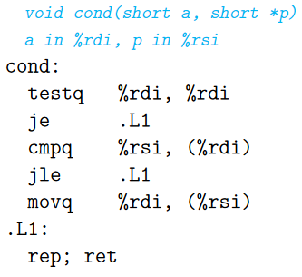

# Exercise 3.16
When given the C code

``` C
void cond(short a, short *p)
{
    if (a && *p < a)
        *p = a;
}
```

gcc generates the following assembly code:



1. Write a goto version in C that performs the same computation and mimics the control flow of the assembly code, in the style shown in Figure 3.16(b). You might find it helpful to first annotate the assembly code as we have done in our examples.

``` C
void cond(short a, short *p) {
    if (a == 0)
        goto done;
    if(a >= *p)
        goto done;
    done:
        return;
}
```

2. Explain why the assembly code contains two conditional branches, even though the C code has only one if statement.

    Because the if statement contains two comparisons.

# Exercise 2
