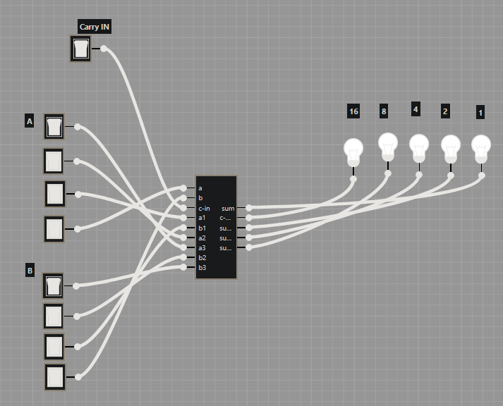

# Exercises

## Exercise 4.1

Determine the byte encoding of the Y86-64 instruction sequence that follows. The line .pos 0x100 indicates that the starting address of the object code should be 0x100.

```asm
.pos 0x100 # Start code at address 0x100
    irmovq $15,%rbx
    rrmovq %rbx,%rcx
loop:
    rmmovq %rcx,-3(%rbx)
    addq %rbx,%rcx
    jmp loop
```

```asm
30 F3 0f 00 00 00 00 00 00 00
20 31
40 13 fd ff ff ff ff ff ff ff
60 31
70 0c 01 00 00 00 00 00 00
```

## Exercise 4.2

For each byte sequence listed, determine the Y86-64 instruction sequence it encodes. If there is some invalid byte in the sequence, show the instruction sequence up to that point and indicate where the invalid value occurs. For each sequence, we show the starting address, then a colon, and then the byte sequence

- 0x100: 30f3fcffffffffffffff4063000800000000000000

```asm
    irmovq $-4, %rbx
    rmmovq %rsi, 0x800(%rbx)
    halt
```

- 0x200: a06f800c020000000000000030f30a0000000000000090

```asm
    pushq %rsi
    call proc
    halt
proc:
    irmovq 10, %rbx
    ret
```

## Exercise 4.7

Let us determine the behavior of the instruction pushq %rsp for an x86-64 processor. We could try reading the Intel documentation on this instruction, but a Section 4.1 The Y86-64 Instruction Set Architecture 407 simpler approach is to conduct an experiment on an actual machine. The C compiler would not normally generate this instruction, so we must use hand-generated assembly code for this task. Here is a test function we have written (Web Aside asm:easm on page 214 describes how to write programs that combine C code with handwritten assembly code):

```asm
    .text
.globl pushtest
pushtest:
    movq %rsp, %rax     // Copy stack pointer
    pushq %rsp Push     // stack pointer
    popq %rdx           // Pop it back
    subq %rdx, %rax     // Return 0 or 8
    ret
```

In our experiments, we find that function pushtest always returns 0. What does this imply about the behavior of the instruction pushq %rsp under x86-64?

## Exercise 4.9

Write an HCL expression for a signal xor, equal to the exclusive-or of inputs a and b. What is the relation between the signals xor and eq defined above?

```HCL
bool xor = (!a && b) || (a && !b);
```

## Exercise 4.13

Fill in the right-hand column of the following table to describe the processing of the irmovq instruction on line 4 of the object code in Figure 4.17:

| stage      | irmovq V, rB          | irmovq $128, %rsp              |
| ---------- | --------------------- | ------------------------------ |
| Fetch      | icode : ifun ← M1[PC] | icode : ifun ← M1[0x016] = 3:0 |
|            | rA : rB ← M1[PC + 1]  | rA : rB ← M1[0x017] = f:4      |
|            | valC ← M8 [PC + 2]    | valC ← M8 [0x018] = 128        |
|            | alP ← PC + 10         | alP ← 0x016 + 10 = 0x020       |
| Decode     |                       |                                |
| Execute    | valE ← 0 + valC       | valE ← 0 + 128 = 128           |
| Memory     |                       |                                |
| Write Back | R[rB] ← valE          | R[%rsp] ← valE = 128           |
| PC Update  | PC ← valP             | PC ← valP = 0x020              |

## Exercise 4.15

What would be the effect of the instruction pushq %rsp according to the steps listed in Figure 4.20? Does this conform to the desired behavior for Y86-64, as determined in Problem 4.7?

## Challenge 6



Stoppede ved en 4-bit addder, men hvis man kobler 2 af dem sammen så får man en 8-bit adder
