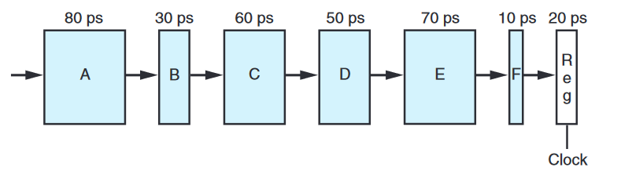

# Exercises

## Exercise 4.28

Suppose we analyze the combinational logic of Figure 4.32 and determine that it can be separated into a sequence of six blocks, named A to F, having delays of 80, 30, 60, 50, 70, and 10 ps, respectively, illustrated as follows:



We can create pipelined versions of this design by inserting pipeline registers between pairs of these blocks. Different combinations of pipeline depth (how many stages) and maximum throughput arise, depending on where we insert the pipeline registers. Assume that a pipeline register has a delay of 20 ps.

- Inserting a single register gives a two-stage pipeline. Where should the register be inserted to maximize throughput? What would be the throughput and latency?
  - Placing a register between C and D would give latency on the first half of 190ps, and 170ps on the second half.
  - This gives a latency of 380ps

- Where should two registers be inserted to maximize the throughput of a three-stage pipeline? What would be the throughput and latency?
  - Placing first register between B and C, and the second register between D and E. 
  - The first section has 130ps latency, the second section has 130ps latency, and the third section has 120ps latency
  - This gives a latency of 390ps

- Where should three registers be inserted to maximize the throughput of a 4-stage pipeline? What would be the throughput and latency?
  - Placing first register between A and B, the second between C and D, and the third between D and E.
  - The first section has 100ps latency, the second section has 110ps latency, the third section has 70ps latency, and the fourth section has 100ps.
  - This gives a latency of 440ps


- What is the minimum number of stages that would yield a design with the maximum achievable throughput? Describe this design, its throughput, and its latency.
  - The optimal number of stages would be 5, with a register inbetweem each step except E and F

## Exercise 5.6

Suppose we wish to write a function to evaluate a polynomial, where a polynomial of degree n is defined to have a set of coefficients $a_0, a_1, a_2, . . . , a_n$. For a value x, we evaluate the polynomial by computing:

$a_0 + a_1x + a_2x^2 + . . . + a_n x^n$

This evaluation can be implemented by the following function, having as arguments an array of coefficients a, a value x, and the polynomial degree degree (the value n in Equation 5.2). In this function, we compute both the successive terms of the equation and the successive powers of x within a single loop:

``` C
double poly(double a[], double x, long degree)
{
 long i;
 double result = a[0];
 double xpwr = x; /* Equals x^i at start of loop */
 for (i = 1; i <= degree; i++) {
    result += a[i] * xpwr;
    xpwr = x * xpwr;
 }
 return result;
}
```

- For degree n, how many additions and how many multiplications does this code perform?
  - n additions
  - 2n multiplications
- On our reference machine, with arithmetic operations having the latencies shown in Figure 5.12, we measure the CPE for this function to be 5.00. Explain how this CPE arises based on the data dependencies formed between iterations due to the operations implementing lines 7–8 of the function.
  - a
